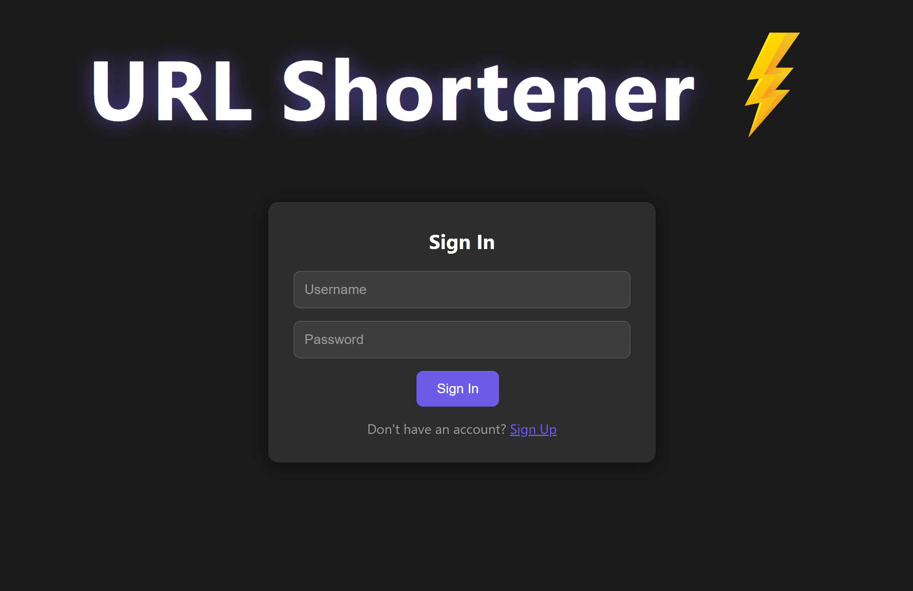
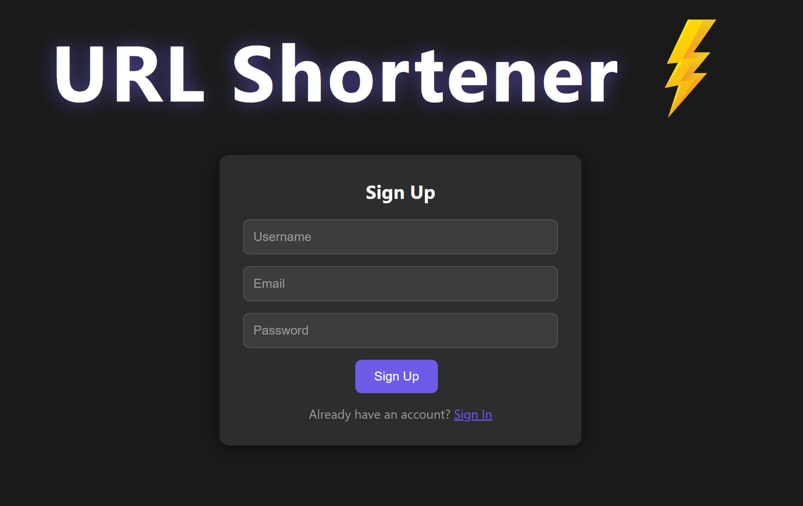
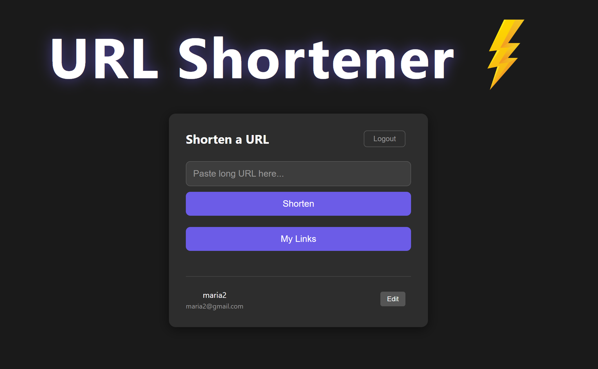
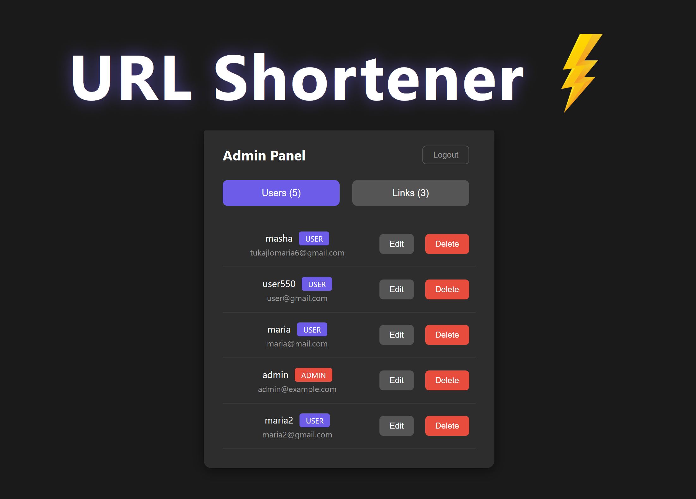

# URL Shortener - Frontend

Single Page Application (SPA) for the URL Shortener service built with React.

##  Backend

Server application: [url-shortener](https://github.com/MariaTukailo/url-shortener)

## 🛠 Technologies

- React 19
- Vite
- Axios
- React Hooks (useState, useEffect)
- CSS

##  Pages

| Page | Description |
|------|-------------|
| **Sign In** | Login form |
| **Sign Up** | New user registration form |
| **My Links** | Create short links, view and delete own links, edit profile |
| **Admin Panel** | Manage users (edit, delete) and view/delete all links |

## Screenshots

### Login page


### Registration page


### User panel


### Admin panel


##  How Authorization Works

- JWT token is stored in browser `localStorage`
- Token is automatically attached to every API request via Axios interceptor
- On token expiration, user is redirected to the login page
- Admin panel is shown based on user role (USER/ADMIN)

##  Getting Started

The app opens at http://localhost:5173

Docker
bash
# Build the image
docker build -t url-shortener-frontend .

# Run the container
docker run -p 80:80 url-shortener-frontend
Then open http://localhost

With docker-compose
Run from the backend repository:

bash
docker compose up --build
This starts backend, frontend, and PostgreSQL together.

### Local
```bash
npm install
npm run dev